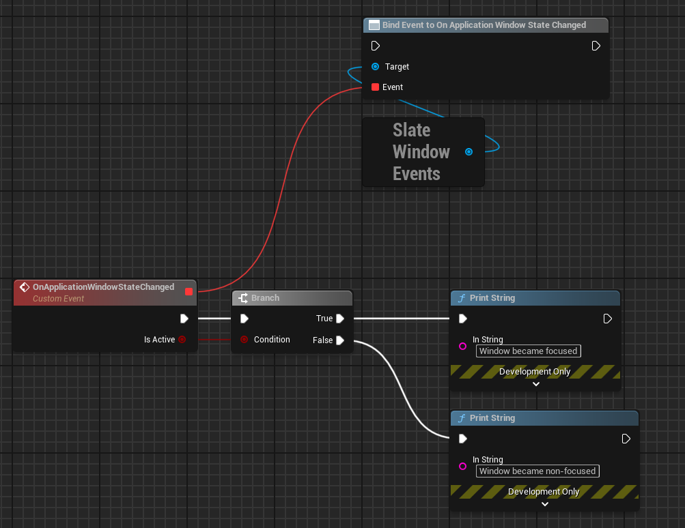

# Slate Window Events Blueprints Extension

This plugin exposes some Slate window events to the blueprints.

## Installation

Clone the repository in your project's Plugin directory.

## Usage

So far, it only exposes one event, but it might grow as my personal needs grow.

